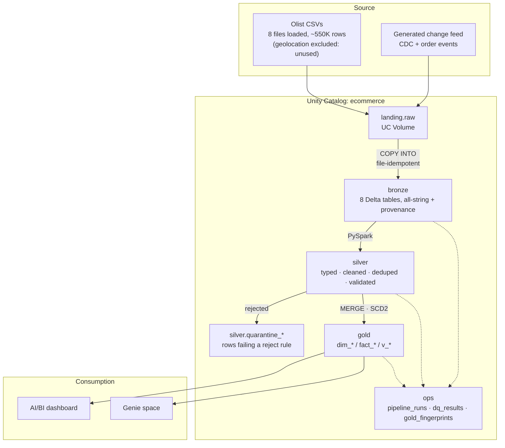
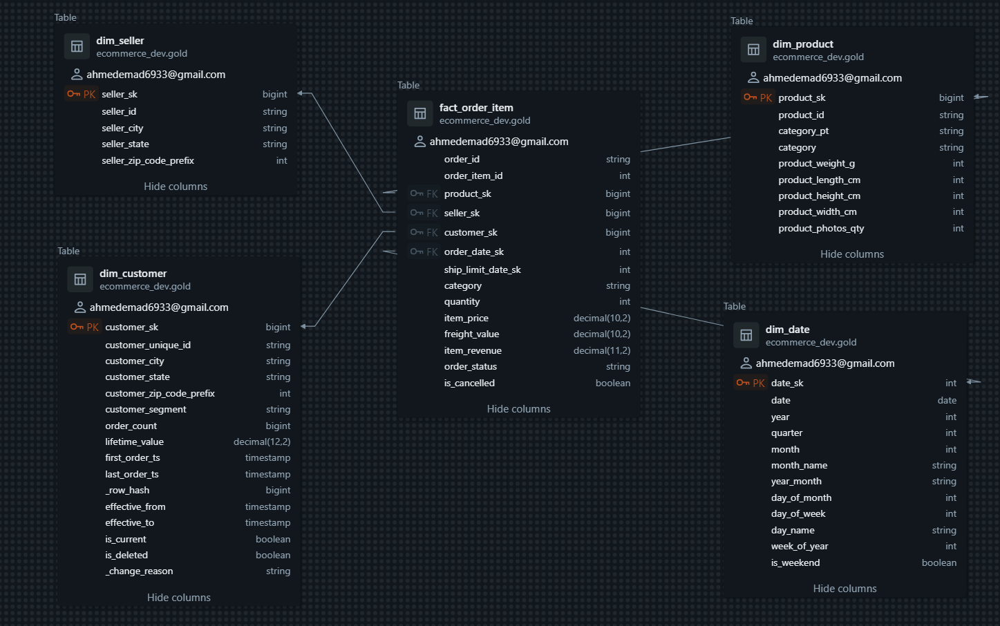

# Databricks E-Commerce Lakehouse

A dimensional analytics platform built on Databricks Free Edition over the Olist
Brazilian e-commerce dataset — eight related operational tables turned into a
Kimball star schema that answers defined business questions.

The point of the project is not the medallion layers. It is this:

```
eight operational entities
   → incremental ingestion (COPY INTO, file-idempotent)
   → data quality + de-duplication (rules, quarantine, audit)
   → CDC (generated change feed: inserts, updates, deletes)
   → SCD Type 2 (point-in-time correct customer history)
   → dimensional model (3 fact grains, 6 conformed dimensions)
   → business analysis (AI/BI dashboard + Genie)
```

Everything runs on **Databricks Free Edition at $0**. The platform constraints
that shaped the design are documented rather than hidden — see
[Free Edition limitations](#free-edition-limitations-and-what-they-changed).

> **Status — the full 8-task pipeline runs green end to end, twice, on a live
> Free Edition workspace.** 550,759 rows across 8 bronze tables, 8 silver,
> 7 quarantine, 6 dimensions, 3 fact grains and 13 analytical views, with CDC
> applied, SCD Type 2 history in place, and the re-run guarantee verified by
> comparing gold fingerprints across two identical runs. Test suite: **46 passed**.
> Every number in this README is measured, not estimated.
>
> **Consumption layer is live**: an AI/BI dashboard (10 widgets) and a Genie
> space, both defined as code in this repo and both verified against the data.
> Every milestone in the original plan is complete.

---

## Architecture



Orchestrated as one linear Lakeflow Job:

```
generate_deltas → bronze_ingest → silver_clean → gold_dims
                → cdc_apply → gold_facts → analytics_views → idempotency_check
```

Linear because Free Edition caps concurrent job tasks at five — not for style.

---

## The data model

Three facts, three grains, stated in every table's `COMMENT`:

| Fact | Grain | Key measures |
|---|---|---|
| `fact_order` | one **order** | `order_total`, `delivery_days`, `delivery_delay_days`, `is_late`, `approval_lag_hours` |
| `fact_order_item` | one **product line within an order** | `item_price`, `freight_value`, `item_revenue` |
| `fact_payment` | one **payment record for an order** | `payment_value`, `payment_installments` |

| Dimension | Type | Natural key |
|---|---|---|
| `dim_date` | generated, conformed | `date` |
| `dim_customer` | **SCD Type 2** | `customer_unique_id` |
| `dim_product` | SCD Type 1 | `product_id` |
| `dim_seller` | SCD Type 1 | `seller_id` |
| `dim_order_status` | conformed lookup | `order_status` |
| `dim_payment_type` | conformed lookup | `payment_type` |

Informational PK/FK constraints are declared so Catalog Explorer renders the
star schema as an ERD.

**16 informational constraints applied** (6 primary keys, 10 foreign keys),
verified in `information_schema.table_constraints`. Unity Catalog does not
enforce them; they exist so Catalog Explorer renders the star schema and so the
joins are documented for anyone reading the model cold.



`fact_order_item` at the centre with its four foreign keys — `product_sk`,
`seller_sk`, `customer_sk`, `order_date_sk` — resolving to `dim_product`,
`dim_seller`, `dim_customer` and `dim_date`, each showing its primary key.
Catalog Explorer draws this from the declared constraints alone; it is not a
hand-made diagram.

The customer dimension's SCD Type 2 machinery is visible in the column list:
`effective_from`, `effective_to`, `is_current`, `is_deleted` and the `_row_hash`
used for change detection.

(The diagram shows one fact's neighbourhood, which is the clearest view of the
star. `fact_order` and `fact_payment` have their own relationships to the same
dimensions — 16 constraints in total across the gold schema.)

### Two traps this model exists to avoid

Both are demonstrated by a query in `sql/views/`, not just described. Full
reasoning in [docs/decisions.md](docs/decisions.md).

**1. The customer key.** Olist issues a **new `customer_id` for every order**;
only `customer_unique_id` is stable across orders. Key `dim_customer` on
`customer_id` and every customer looks brand new — repeat-purchase rate collapses
to ~0%, LTV equals AOV, and SCD2 never fires. Nothing errors; every number is
just wrong. `gold.v_repeat_rate_key_comparison` computes the metric both ways.

Measured on the loaded data:

| | correct key (`customer_unique_id`) | naive key (`customer_id`) |
|---|---|---|
| distinct customers | **96,096** | 99,441 |
| phantom customers introduced | — | **+3,345** |
| repeat customers found | **2,997** | 0 |
| **repeat-purchase rate** | **3.12%** | **0.00%** |

Not understated — **destroyed**. The naive key reports that not one customer in
99,441 ever ordered twice, and nothing errors while it does so. 3,345 people are
counted two or more times, and every one of them is a repeat customer the model
would classify as brand new. Average lifetime value would collapse to average
order value (measured: $164.87 against 1.035 orders per customer).

**2. Payment fan-out.** An Olist order carries N payment rows (installments,
voucher + card splits). Measured: **103,886 payment rows across 99,440 orders
= 1.0447 payments per order.** Joining payments onto order grain therefore
inflates revenue by **~4.5%** — more dangerous than a factor of ten, because a
number that is 4.5% wrong looks plausible and ships. `gold.v_fanout_demo` shows
correct and inflated revenue side by side.

### The payoff query

> *What city and segment was this customer in **at the time** order X was placed?*

`gold.v_order_point_in_time` answers it by joining `fact_order.customer_sk` to
the customer **version** current at purchase time, and puts the present-day
values in adjacent columns so the difference is visible. This is the query that
proves SCD Type 2 was implemented rather than named.

**Measured, after applying one day of CDC changes:**

| order date | city at order time | city today |
|---|---|---|
| 2018-05-19 | sao paulo | belo horizonte |
| 2018-07-08 | sao luis | sao paulo |
| 2018-01-18 | curitiba | fortaleza |
| 2018-01-29 | piracicaba | manaus |
| 2018-03-13 | mogi das cruzes | fortaleza |

Each order resolved to the customer version valid at *its own* purchase
timestamp. A natural-key join would have reported the right-hand column for all
of them, silently restating history.

**The number that proves closed versions stay joinable:** of 99,441 fact rows,
**51 now point at a closed (`is_current = false`) version** and 99,390 at a
current one — with **0 unresolvable** surrogate keys. Superseding a version does
not orphan the facts that reference it, which is the entire reason SCD2 works.

### SCD2 state after CDC day 1

| | count |
|---|---|
| total versions | 96,144 |
| distinct customers | 96,099 |
| current versions | 96,099 (exactly one per customer) |
| closed versions | 45 (40 changed + 5 deleted) |
| tombstones (`is_deleted`) | 5 |
| live population (`is_current AND NOT is_deleted`) | 96,094 |

Day 1 carried 49 change rows → 48 distinct keys after dedup → 40 `changed`,
5 `deleted`, 3 `new`. Every row accounted for, no key left with zero or several
current versions, and no overlapping validity windows.

**Carry-forward held: 40 of 40** new versions kept their `lifetime_value`,
`order_count`, `first_order_ts`, `customer_segment` and zip — zero blanked. A
city change must not erase a customer's financial history, and it didn't.

**Dedup held:** the generator plants a duplicate key whose later `updated_at`
sits at an arbitrary file position. The surviving version is
`correct-city-wins`, so neither first-row-seen nor last-row-seen decided it —
only ordering by `updated_at`.

---

## Business questions

| # | Question | View |
|---|---|---|
| 1 | How does revenue change over time? | `v_revenue_monthly` |
| 2 | Which categories generate the most revenue? | `v_revenue_by_category` |
| 3 | Which sellers perform best, by month? | `v_seller_monthly_performance` |
| 4 | What is the repeat-purchase rate? | `v_repeat_purchase_rate` |
| 5 | How long do shipments take, and how often are they late? | `v_delivery_performance` |
| 6 | Which categories are cancelled most? | `v_cancellation_by_category` |
| 7 | How do payment methods affect order completion? | `v_payment_method_completion` |

The dashboard reads these views, never the fact tables directly, so a model
change does not break the dashboard.

All 13 views build and return data. Sample measured answers:

| question | answer |
|---|---|
| top category by revenue | `health_beauty` — $1,437,666 (9.14% of total) |
| worst delivery state | Maranhão — 21.5 days avg, **18.80% late** (750 orders) |
| payment mix | credit card 76,505 orders, 3.51 avg installments, 97.12% completion |
| repeat-purchase rate | 3.12% |

### The dashboard is code, not clicks

[`dashboards/ecommerce_overview.lvdash.json`](dashboards/ecommerce_overview.lvdash.json)
is committed and deployed from the repo:

```bash
databricks lakeview create   --display-name "Olist E-Commerce Lakehouse - Overview"   --warehouse-id <WAREHOUSE_ID>   --dataset-catalog ecommerce_dev --dataset-schema gold   --serialized-dashboard "$(cat dashboards/ecommerce_overview.lvdash.json)"   --json '{"parent_path": "/Workspace/Users/<you>"}'
```

Ten widgets over five datasets, every one reading a documented `gold` view
rather than a fact table: four KPI counters (revenue, orders, repeat rate,
delivery time), a monthly revenue line, a top-10 category bar, a late-rate bar
by state, and a payment-mix pie.

Two deliberate choices visible in the JSON:

- **The revenue trend filters to months with 100+ orders.** Olist starts
  mid-2016 and stops on 17 October 2018, so the partial edge months would render
  as a cliff and read as a collapse that never happened.
- **State delivery rates are computed from counts, not by averaging monthly
  percentages.** An unweighted average of averages understates the worst states
  — Maranhão reads 16.7% that way against a true **18.8%**. The dataset SQL
  carries a comment saying so, because it is the kind of thing that gets
  "simplified" back into a bug.

### Genie space — the model tested by asking it questions

[`genie/genie_space.json`](genie/genie_space.json) is committed and deployed with
`databricks genie create-space`. It sits on the **star schema itself** — 3 facts,
4 dimensions — not on the views, because Genie joining facts to dimensions
correctly is the evidence the model is well-named. Its single
`text_instructions` entry encodes the grain rules and both traps.

**Verified by asking it, then checking the SQL it wrote:**

| question | did it get it right? |
|---|---|
| *"What is our repeat-purchase rate?"* | **Yes** — grouped by `customer_unique_id`, returned 96,096 customers / 2,997 repeat / **3.12%**, matching ground truth exactly. Had it reached for `customer_id` the answer would have been 0.00%. |
| *"Total revenue broken down by payment method?"* | **Yes** — stayed inside `fact_payment` and summed `payment_value`. It did **not** join to `fact_order` and sum `order_total`, which is the 4.5% fan-out error the question invites. |

The second is the one worth reading twice: revenue-by-payment-method is precisely
the question whose obvious join is wrong, and the space declined it.

It also improved on the SQL I taught it, substituting `try_divide` for plain
division in the rate calculation.

---

## Idempotency

"What happens if the job runs twice?" is answered by a task, not a claim.
Three distinct guarantees:

1. **File-level** — `COPY INTO` tracks consumed files; nothing is ingested
   twice. A re-run reports **0 inserted rows**, which is the guarantee showing
   up as a measurement rather than a claim.
2. **Write-level** — silver and gold are deterministic rebuilds of the layer
   below (`CREATE OR REPLACE`, `MERGE` on business keys). SCD2 is the exception
   and handles it by classifying replayed rows as `unchanged`.
3. **End-to-end** — `idempotency_check` fingerprints every gold table (row
   counts + additive measure sums) into `ops.gold_fingerprints` and **fails the
   job** if a re-run of the same `run_date` differs.

Deterministic surrogate keys (hashes, not sequences) are what make (2) possible:
rebuilding a dimension cannot renumber keys that facts already point at.

**Measured across two identical full-pipeline runs of `run_date = 2018-10-01`:**

| gold table | run 1 | run 2 |
|---|---|---|
| `dim_customer` | 96,144 | **96,144** |
| `dim_date` | 1,139 | **1,139** |
| `dim_product` | 32,951 | **32,951** |
| `dim_seller` | 3,095 | **3,095** |
| `fact_order` | 99,441 | **99,441** |
| `fact_order_item` | 112,650 | **112,650** |
| `fact_payment` | 103,886 | **103,886** |

Not one row count or measure sum moved. Two figures from `ops.pipeline_runs`
make the mechanism visible rather than merely asserted:

- **`bronze_ingest`: 0 rows read, 0 written** on the second run. `COPY INTO`
  re-consumed nothing — file-level idempotency as a measurement.
- **`cdc_apply`: 49 rows read, 0 written.** The change file was deliberately
  replayed after already being applied; all 48 distinct keys classified
  `unchanged`, including the 5 deletes, so no version was opened.

What this does **not** prove: two runs wrong in identical ways both pass. It is a
determinism guard, not a correctness proof — `v_reconciliation` and
`v_scd2_integrity` cover that, and both are clean.

---

## Data quality

**23 rules** (20 `reject`, 3 `warn`) across 7 tables, defined as data in
`src/silver/dq.py`. One definition
drives the clean/quarantine split, the per-run counts in `ops.dq_results`, and
this table.

| Severity | Behaviour | Example |
|---|---|---|
| `reject` | row diverted to `silver.quarantine_<table>` | `order_items.price_non_negative` |
| `warn` | row loads, failure still counted | `products.category_present` — **measured: 610 of 32,951 products (1.85%)** have no category but carry real revenue; dropping them would understate totals |

Two details that matter more than the rule count:

- **A NULL predicate result counts as a failure.** `price >= 0` is NULL when
  `price` is NULL, and a naive filter passes that row. Tested.
- **`warn` exists because Olist is real data.** Deliveries recorded before
  approval do occur; that is worth surfacing, not worth dropping the order over.

**No `reject` rule fires on real Olist data** — it is clean enough that every
`quarantine_*` table is empty after a normal load. An empty quarantine table
looks identical whether routing works or is silently broken, so
[`notebooks/98_dq_probe.py`](notebooks/98_dq_probe.py) injects a known-bad batch,
runs the real `clean_all()` path, asserts all five reject rules fired (including
a NULL-price row, which a naive filter would pass), then restores bronze via
Delta time travel and asserts the lakehouse matches its pre-probe baseline.

**Probe result — measured, and independently re-verified from outside the probe:**

| rule | rows failed | expected |
|---|---|---|
| `order_items.price_non_negative` | **3** | 3 (negative, **NULL**, and the two-rule row) |
| `order_items.freight_non_negative` | **2** | 2 |
| `order_items.order_id_not_null` | **1** | 1 |
| `order_items.product_id_not_null` | **1** | 1 |
| `order_items.item_sequence_positive` | **1** | 1 |

8 rule-failures across **7 quarantined rows** (one row breaks two rules), out of
`rows_checked = 112,658` — the 112,650 real rows plus 8 probe rows. The clean
control row reached silver. `price_non_negative` counting **3** rather than 2 is
the important number: it includes the NULL-price row, proving a NULL predicate
result is treated as a failure rather than passing a naive filter.

Restoration verified independently of the probe's own assertions:
`bronze.order_items` 112,650, `silver.order_items` 112,650,
`quarantine_order_items` 0 — all back to baseline, zero synthetic rows anywhere,
and `DESCRIBE HISTORY` shows `version 3 | RESTORE`, so the whole exercise is
auditable after the fact.

**`ops.dq_results` after a full run** — a table rather than a screenshot, so it
stays greppable and diffable:

| table | rule | severity | checked | failed | rate |
|---|---|---|---|---|---|
| `products` | `products.category_present` | warn | 32,951 | **610** | 1.85% |

That single row is the whole argument for the `warn` severity. 610 products
carry real revenue with no category; they load, they are counted, and nothing is
dropped. Every `reject` rule reports 0 failures on real Olist data — which is
why the probe above exists.

---

## Observability

| Table | Grain | Contents |
|---|---|---|
| `ops.pipeline_runs` | (run_id, task_name) | status, duration, rows read/written/quarantined, error |
| `ops.dq_results` | (run_id, table, rule_id) | rows checked, rows failed, failure rate |
| `ops.gold_fingerprints` | (run_id, table) | row counts + measure sums per run |

Failures are logged **and re-raised** — a task that logs "succeeded" while
failing silently is worse than no logging.

---

## Repository layout

```
src/
  config.py              source-table registry driving every layer's loop
  generator/             deterministic CDC + event generator (pure Python)
  bronze/ingest.py       COPY INTO (active); Auto Loader kept, does not work here
  silver/
    transforms.py        PURE DataFrame -> DataFrame functions (all unit-tested)
    dq.py                rule registry
    clean.py             I/O driver composing the above
  gold/
    scd2.py              change classification (pure) + Delta MERGE driver
    dims.py  facts.py    dimensions and the three fact grains
  ops/
    run_log.py           pipeline_runs + dq_results
    idempotency.py       fingerprint + cross-run comparison
sql/views/               13 documented analytical + reconciliation views
dashboards/              AI/BI dashboard as code (.lvdash.json)
genie/                   Genie space as code (serialized_space JSON)
notebooks/               thin job entrypoints (logic lives in src/)
tests/                   19 tests; 3 pin the SCD2 transitions
resources/               Lakeflow Job as YAML
databricks.yml           Declarative Automation Bundle
docs/decisions.md        every non-obvious choice, with reasoning
```

The split between `transforms.py` (pure) and `clean.py` (I/O) exists for one
reason: it makes the logic that carries correctness risk testable without a
metastore.

---

## Running it

Full setup, including the Free Edition prerequisites, is in
[docs/SETUP.md](docs/SETUP.md).

```bash
databricks bundle validate
databricks bundle deploy --target dev
databricks bundle run ecommerce_pipeline --target dev
```

Re-run the same logical date to exercise the idempotency check:

```bash
databricks bundle run ecommerce_pipeline --target dev
```

Apply a day of CDC changes:

```bash
databricks bundle run ecommerce_pipeline --target dev -- --cdc_day 1
```

### Tests

Run them **in the workspace** via `notebooks/99_run_tests.py`. Local PySpark on
Windows needs a JDK plus `winutils.exe`/`HADOOP_HOME`, which is a time sink with
no payoff here. `tests/conftest.py` reuses the Databricks session when present
and builds a local one otherwise, so both paths work if you do have a JDK.

**Measured: `46 passed` in 36.6s**, run in-workspace via
[`notebooks/99_run_tests.py`](notebooks/99_run_tests.py).

| file | tests | covers |
|---|---|---|
| `test_scd2.py` | 19 | change classification, carry-forward resolution, replay safety |
| `test_transforms.py` | 13 | cleaning, dedup ordering, DQ severity, ANSI-safe casts |
| `test_config.py` | 7 | catalog resolution at call time, source-table registry |
| `test_sql_files.py` | 7 | SQL statement splitting, incl. the real view files |

The first in-workspace run found a **real production bug**: `parse_timestamps`
used `to_timestamp`, whose docstring claimed unparseable input becomes NULL.
Under ANSI mode — on by default on serverless — it *raises*, so one malformed
date would have aborted `silver_clean` instead of nulling the value for a DQ
rule to quarantine. `cast_numerics` had the identical flaw. Both now use
`try_to_timestamp` / `try_cast`. Olist's clean timestamps had hidden it
completely; only executing the suite surfaced it.

---

## Free Edition limitations, and what they changed

Stated plainly because these are platform limits, not design preferences — and
because knowing where a platform stops is part of knowing the platform.

| Limitation | Consequence for this project |
|---|---|
| Serverless only, no custom compute | No cluster-tuning story. Not attempted. |
| Spark UI unavailable (query profile only) | Performance analysis reads query profiles and `EXPLAIN`, not stage timelines. |
| `cache()` / `persist()` blocked | `apply_scd2` materialises to a staging table instead of caching a thrice-scanned DataFrame. |
| Only 6 Spark configs settable | `autoBroadcastJoinThreshold` and AQE cannot be changed, so a broadcast-vs-sort-merge benchmark is not a controlled experiment. Dropped rather than faked. |
| `Trigger.AvailableNow()` only | Streaming here is **micro-batch incremental ingestion**, not real-time. Named that way throughout. |
| **Auto Loader cannot start a streaming query at all** | Hit in practice, not predicted: `SPARK_CONNECT_ILLEGAL_STATE.…OPERATION_STATUS_MISMATCH` on the first table. `_schemas/customers` *was* written to the volume first, so volume writes and schema inference work — the fault is Spark Connect's streaming-query lifecycle, and serverless is Spark Connect only. Switched to `COPY INTO`, which was already coded as the fallback and gives identical file-level idempotency with no checkpoint. |
| Max 5 concurrent job tasks | Linear DAG. |
| One active pipeline per type | Both Lakeflow extensions share one pipeline. |
| One workspace / metastore / user | Governance shown via PK/FK constraints, comments and lineage — not `GRANT`s to invented groups. |
| Restricted outbound internet | Olist CSVs are uploaded from a laptop, not downloaded in a notebook. PyPI is reachable, so the generator runs in-workspace. |
| Quota breach halts compute for the day | No development cron; warehouse stopped manually; data held at ~550K rows. |

---

## Planned extensions

Not part of the core deliverable; each earns its way in.

1. **`AUTO CDC` comparison** — reproduce the SCD2 dimension with
   `AUTO CDC INTO ... STORED AS SCD TYPE 2` and write up hand-rolled vs
   declarative.
2. **Streaming path** — order events with watermarks,
   `dropDuplicatesWithinWatermark`, and windowed aggregation over the generated
   late/out-of-order events.
3. **CI** — GitHub Actions running `ruff` + `databricks bundle validate`.
4. **Data contracts** — source schemas as YAML, breaking changes fail the job.
5. **Performance notebook** — query profiles, `EXPLAIN FORMATTED`, Delta file
   skipping, liquid clustering, `OPTIMIZE`/`VACUUM`. Last on the list because
   serverless exposes the least here.

---

## Data attribution

Brazilian E-Commerce Public Dataset by Olist, published on Kaggle under
**CC BY-NC-SA 4.0**. Used here for non-commercial portfolio purposes.
The CSVs are **not** committed to this repository — see `docs/SETUP.md` for how
to obtain and upload them.

The CDC change feed and order-event stream are **generated**
(`src/generator/make_deltas.py`), because Olist is a static export with no
`updated_at`, no deletes and no change feed, and therefore cannot demonstrate
incremental loading or SCD2 on its own.
